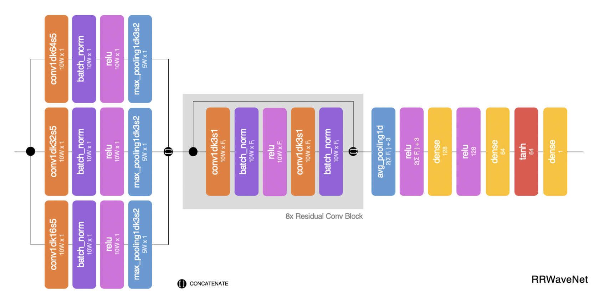

# RRWaveNet: A Compact End-to-End Multiscale Residual CNN for Robust PPG Respiratory Rate Estimation

Official implementation of **RRWaveNet** from *IEEE Internet of Things Journal (IOTJ)*.

**Paper authors**: Pongpanut Osathitporn, Guntitat Sawadwuthikul, Punnawish Thuwajit, Kawisara
Ueafuea, Thee Mateepithaktham, Narin Kunaseth, Tanut Choksatchawathi, Proadpran Punyabukkana,
Emmanuel Mignot, and Theerawit Wilaiprasitporn

## Abstract

[](https://ieeexplore.ieee.org/abstract/document/10098530)


<p>
<b>Figure: </b> Composed of three modules, RRWaveNet involves the multiscale convolution (left), the
deep spatial-temporal residual blocks (center), and the RR estimator (right). Each layer’s title is
abbreviated at the top row for simplicity and the shape of the output tensor after each layer is
specified below its title. For example, conv1dk32s5, the leftmost layer in the center module, refers
to a 1-D-convolutional layer with a kernel of size 32 and a stride of 5, resulting a (10 W, 1)
tensor.
</p>

Respiratory rate (RR) is an important biomarker as RR changes can reflect severe medical events,
such as heart disease, lung disease, and sleep disorders. Unfortunately, standard manual RR counting
is prone to human error and cannot be performed continuously. This study proposes a method for
continuously estimating RR, RRWaveNet. The method is a compact end-to-end deep learning model which
does not require feature engineering and can use low-cost raw photoplethysmography (PPG) as input
signal. RRWaveNet was tested subject-independently and compared to baseline in four data sets
(BIDMC, CapnoBase, WESAD, and SensAI) and using three window sizes (16, 32, and 64 s). RRWaveNet
outperformed current state-of-the-art methods with mean absolute errors at an optimal window size of
$1.66 \pm 1.01$, $1.59 \pm 1.08$, $1.92 \pm 0.96$, and $1.23 \pm 0.61$ breaths per minute for each
data set. In remote monitoring settings, such as in the WESAD and SensAI data sets, we apply
transfer learning to improve the performance using two other ICU data sets as pretraining data sets,
reducing the MAE by up to 21%. This shows that this model allows accurate and practical estimation
of RR on affordable and wearable devices. Our study also shows feasibility of remote RR monitoring
in the context of telemedicine and at home.

## Usage

### Download and install the dependencies

```bash
# Clone the repository
git clone https://github.com/IoBT-VISTEC/RRWaveNet

# Install dependencies. Recommend to use a separate environment.
pip install -r requirements.txt
```

### Prepare the data

The data must be accessible at `/path/to/this/repo/data/{dataset_name}/{file}_{winsize}.npy` where
`file` must be both `X` and `RR` (`CO2` is also required to run `RespNet`). For example:

```text
data
└── bidmc
    ├── CO2_16.npy
    ├── RR_16.npy
    └── X_16.npy
```

The structure of each `X_*.npy` and `CO2_*.npy` file should

- Be iterable
- Consist of `n_subjects` elements, all iterable
- Each of the `n_subjects` should contain `n_windows` elements
- Each of the `n_windows` elements should be a 1D `np.ndarray` which contains the data of PPG or
  CO2 of 1 minute in length with a shape of `(60 * sampling_rate, )`

For `RR_*.npy` files, they should

- Be iterable
- Consist of `n_subjects` elements, all iterable
- Each of the `n_subjects` should contain `n_windows` floats, each number indicating the BPM of the
  corresponding window

```python
# Example
x = np.load(f"data/bidmc/X_16.npy", allow_pickle=True)
y = np.load(f"data/bidmc/RR_16.npy", allow_pickle=True)

print(len(x))           # 50
print(len(x[0]))        # 141
print(len(x[1]))        # 150
print(type(x[0][0]))    # <class 'numpy.ndarray'>
print(x[0][0].shape)    # (2000,)

print(len(y))           # 50
print(len(y[0]))        # 141
print(type(y[0][0]))    # <class 'numpy.float64'>
```

### Run the experiment

```bash
python main.py --model [model_name] --dataset [dataset_name] --winsize [window_size]
```

Valid options are

- `--model`: `DeepLearning`, `RespNet`, `RespWatch`, or `RRWaveNet`.
- `--dataset`: Depends on the available data you prepared, we used `bidmc`, `capnobase`, and `wesad`
  for the experiments in the paper.
- `--winsize`: Depends on the available data you prepared, we used `16`, `32`, and `64` for our
  experiments.

> The implementation of AR is not provided in this repository. We recommend the reproducing steps
> as defined in the original paper.

When the experiment finishes, the average and standard deviation of the MAEs across all subjects
will be printed.

Should you encounter any issue or bug, please create an issue with details [here](https://github.com/IoBT-VISTEC/RRWaveNet/issues).

## Citation

**Plaintext**

P. Osathitporn *et al.*, "RRWaveNet: A Compact End-to-End Multiscale Residual CNN for Robust PPG
Respiratory Rate Estimation," in *IEEE Internet of Things Journal*, vol. 10, no. 18, pp.
15943-15952, 15 Sept.15, 2023, doi: 10.1109/JIOT.2023.3265980.

**BibTeX**

```latex
@ARTICLE{10098530,
  author={Osathitporn, Pongpanut and Sawadwuthikul, Guntitat and Thuwajit, Punnawish and Ueafuea, Kawisara and Mateepithaktham, Thee and Kunaseth, Narin and Choksatchawathi, Tanut and Punyabukkana, Proadpran and Mignot, Emmanuel and Wilaiprasitporn, Theerawit},
  journal={IEEE Internet of Things Journal}, 
  title={RRWaveNet: A Compact End-to-End Multiscale Residual CNN for Robust PPG Respiratory Rate Estimation}, 
  year={2023},
  volume={10},
  number={18},
  pages={15943-15952},
  doi={10.1109/JIOT.2023.3265980}}
```
